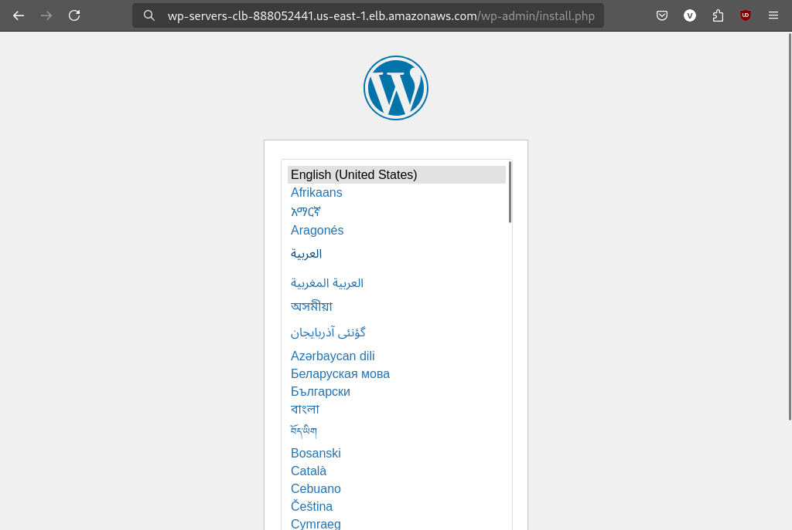
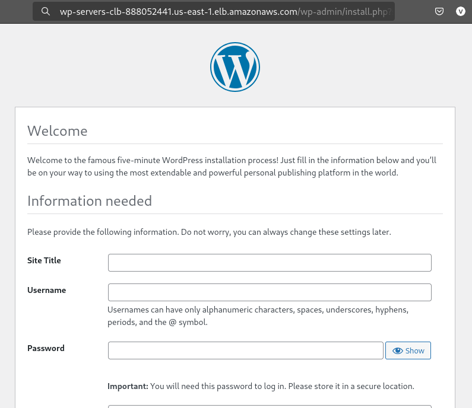
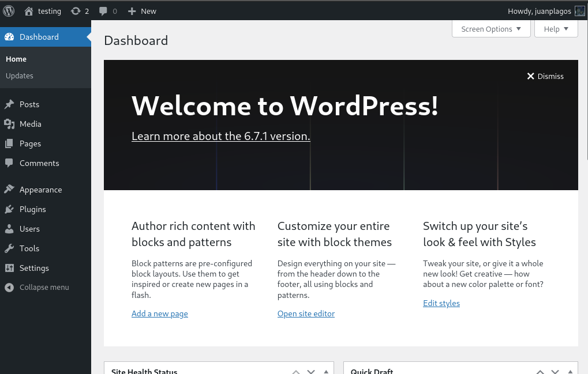

[](README.en.md)
[](README.md)

# High Availability Infrastructure for WordPress Hosting on AWS

## About the Project

This project consists on implementing a scalable infrastructure to host WordPress applications on AWS. The solution involves installing and configuring Docker on EC2 instances, using an initialization script to automate the process. Additionally, the project includes setting up a MySQL database managed by Amazon RDS, integrating Amazon EFS for file sharing between EC2 instances hosting WordPress, and implementing an Application Load Balancer to distribute traffic between instances across multiple Availability Zones, ensuring high availability. The EC2 instances are managed by an Auto Scaling Group, which automatically adjusts capacity based on demand, ensuring that the application scales efficiently and remains available even during traffic spikes.

### Table of Contents

1. [Prerequisites](#1-prerequisites)
2. [Virtual Environment Configuration](#2-virtual-environment-configuration)
    - 2.1 [General Settings](#21-general-settings)
    - 2.2 [VPC Creation](#22-vpc-creation)
3. [Security Groups Configuration](#3-security-groups-configuration)
    - 3.1 [Creating Security Groups](#31-creating-security-groups)
    - 3.2 [Configuring Inbound and Outbound Rules](#32-configuring-inbound-and-outbound-rules)
4. [Elastic File System (EFS) Configuration](#4-elastic-file-system-efs-configuration)
    - 4.1 [General Settings](#41-general-settings)
    - 4.2 [Network Settings](#42-network-settings)
    - 4.3 [File System Policy](#43-file-system-policy)
    - 4.4 [Configuration Review](#44-configuration-review)
5. [Relational Database Service Configuration](#5-relational-database-service-configuration)
    - 5.1 [General Settings](#51-general-settings)
    - 5.2 [Network Settings](#52-network-settings)
    - 5.3 [Authentication Settings](#53-authentication-settings)
    - 5.4 [Additional Settings](#54-additional-settings)
6. [Application Load Balancer Configuration](#6-application-load-balancer-configuration)
    - 6.1 [General Settings](#61-general-settings)
    - 6.2 [Network Settings](#62-network-settings)
7. [Auto Scaling Group Configuration](#7-auto-scaling-group-configuration)
    - 7.1 [General Settings](#71-general-settings)
    - 7.2 [Launch Template Configuration](#72-launch-template-configuration)
    - 7.3 [Creating the ASG](#73-creating-the-asg)
8. [Testing the Infrastructure Implementation](#8-testing-the-infrastructure-implementation)

## 1. Prerequisites

- An active AWS account
- Basic knowledge of AWS console
- Basic knowledge of Linux terminal
- Familiarity with containerization

## 2. Virtual Environment Configuration

Before creating the EC2 instances that will host WordPress applications and configuring other security, storage, and load balancing services, we need to configure the network environment where the project will run. We will create a VPC (Virtual Private Cloud) dedicated to the project.

> [!NOTE]
> AWS offers two options for VPC creation: manual and automatic. In manual creation, you configure the VPC, subnets, routers, gateways, and other network options in a customized way. In the automatic option, the **VPC wizard** creates the VPC with public and private subnets, attaches an internet gateway, configures route tables, and includes a NAT gateway if necessary. We will use automatic creation with the VPC wizard.

### 2.1 General Settings

1. In the AWS console, access the VPC service and click "**Create VPC**".

2. Under "**VPC Settings**" select "**VPC and more**"

3. In "**Auto-generate tag name**", leave checked to automatically generate names.

4. In the input field, enter the tag you want to use as a prefix for the names of resources that will be created.

5. Configure the resources:

| Resource | Specification |
|----------|---------------|
| VPC CIDR | 10.0.0.0/16 |
| Availability Zones (AZs) | 2 |
| Public subnets | 2 |
| Private subnets | 4 |
| NAT Gateway | 1 per AZ |
| VPC endpoints | None |

6. Optionally, add descriptive tags to the VPC. This helps to easily identify resources associated with the project.

## 2.2 VPC Creation

1. Click "**Create VPC**" and wait for the resources to be created.

2. The wizard will automatically create:

    - A VPC with DNS hostnames enabled
    - Two public subnets, one in each selected Availability Zone (AZ)
    - Two private subnets, one in each AZ, for application servers and database storage
    - An Internet Gateway (IGW) attached to the VPC
    - Two NAT Gateways, one in each public subnet, to allow internet access for private subnets
    - Route tables configured for:

        - public subnets with routes to the Internet Gateway
        - private subnets with routes to their respective NAT Gateways

    - A default security group

#### VPC Workflow Preview


## 3. Security Groups Configuration

As each resource requires distinct traffic rules, we will create specific security groups for each of them to separate responsibilities, facilitate management, and increase security.

### 3.1 Creating Security Groups

> [!IMPORTANT]
> At this first moment, we will create only the security groups, without any traffic rules. This is necessary because some security groups will need to reference others in their inbound or outbound rules in future steps.

In the **VPC Dashboard**, navigate to the "**Security**" section and click on "**Security Groups**". After that, click on "**Create security group**".

We will create a security group for the load balancer, EC2 instances, EFS, and RDS. For each security group, we will fill in:

- Security group name
- Description
- VPC ID (select the VPC created for the project)

### 3.2 Configuring Inbound and Outbound Rules

After creating the security groups, we will proceed with configuring the inbound and outbound rules for each of them.

#### 3.3 Application Load Balancer (ALB) Security Group

1. Select the ALB security group, click "**Actions**" and "**Edit inbound rules**".

2. Click "**Add rule**" and add a rule for **HTTP**:

    - Type: HTTP
    - Port: 80
    - Source type: custom
    - Source: anywhere-ipv4 (0.0.0.0/0)

3. Click "**Save rules**".

4. Select the ALB security group again, click "**Actions**" and "**Edit outbound rules**".

5. Click "**Add rule**" and add a rule to allow traffic to **EC2 instances**:

    - Type: HTTP
    - Port: 80
    - Destination type: custom
    - Destination: select the **EC2 instances security group**

#### 3.4 EC2 Instances Security Group

1. Select the EC2 instances security group, click "**Actions**" and "**Edit inbound rules**".

2. Click "**Add rule**" and add a rule for **HTTP**:

    - Type: HTTP
    - Port: 80
    - Source type: custom
    - Source: select the **ALB security group**

3. Add a rule for **NFS**:

    - Type: NFS
    - Port: 2049
    - Source type: custom
    - Source: select the **EFS security group**

4. Add a rule to allow traffic from **RDS**:

    - Type: MySQL/Aurora
    - Port: 3306
    - Source type: custom
    - Source: select the **RDS security group**

5. Click "**Save rules**".

6. Select the EC2 instances security group again, click "**Actions**" and "**Edit outbound rules**".

7. In "**outbound rules**", remove the default rule to avoid routing conflicts, and then click "**Add rule**".

8. Add a rule to allow traffic to **RDS**:

    - Type: MySQL/Aurora
    - Port: 3306
    - Destination type: custom
    - Destination: select the **RDS security group**

9. Add a rule to allow traffic to **EFS**:

    - Type: NFS
    - Port: 2049
    - Destination type: custom
    - Destination: select the **EFS security group**

10. Add a rule for **HTTPS**:

    - Type: HTTPS
    - Port: 443
    - Destination type: custom
    - Destination: select the **ALB security group**

11. Click "**Save rules**".

#### 3.5 Elastic File System (EFS) Security Group

1. Select the EFS security group, click "**Actions**" and "**Edit inbound rules**".

2. In "**Inbound rules**", click "**Add rule**".

3. Add a rule for **NFS**:

    - Type: NFS
    - Port: 2049
    - Source type: custom
    - Source: select the **EC2 instances security group**

4. Click "**Save rules**".

5. Check the "**Outbound rules**":
    
    - Keep the rule that allows all outbound traffic

#### 3.6 Relational Database Service (RDS) Security Group

1. Select the RDS security group, click "**Actions**" and "**Edit inbound rules**".

2. In "**Inbound rules**", click "**Add rule**".

3. Add a rule for **MySQL/Aurora**:

    - Type: MySQL/Aurora
    - Port: 3306
    - Source type: custom
    - Source: select the **EC2 instances security group**

4. Click "**Save rules**".

5. Check the "**Outbound rules**":
    
    - Keep the rule that allows all outbound traffic

## 4. Elastic File System (EFS) Configuration

We will configure an elastic file system so that instances hosting WordPress can share files even across different availability zones.

#### 4.1 General Settings

1. In the AWS console search bar, search for "**EFS**".

2. On the service homepage, click "**Create file system**" and "**Customize**".

3. Give the file system a name.

4. Under "**File system type**", select "**Regional**".

5. Keep the default **general settings**:

    - Automatic backup: **Enabled**
    - Lifecycle management:
        - Transition to Infrequent Access: **30 days since last access**
        - Transition to Archive: **90 days since last access**
        - Transition to Standard: **None**
    - Encryption: **Enabled**

6. Keep the default **performance settings**:

    - Throughput mode: "**Bursting**" and "**Elastic**"

7. Check the **additional settings** and make sure "**General purpose**" is selected.

8. Optionally, add descriptive tags to the file system to improve resource identification.

9. Click "**Next**".

#### 4.2 Network Settings

1. Under "**Network**", select the VPC created for the project.

2. Under "**Mount targets**", we will add two mount targets, one for each availability zone:

    AZ 1:
    - Availability zone: "**us-east-1a**"
    - Subnet ID: select the available **private subnet**
    - IP address: keep the default ("**Automatic**")
    - Security groups: select the **EFS security group**
   
    AZ 2:
    - Availability zone: "**us-east-1b**"
    - Subnet ID: select the available **private subnet**
    - IP address: keep the default ("**Automatic**")
    - Security groups: select the **EFS security group**

3. Click "**Next**".

#### 4.3 File System Policy

Keep all options as default and click "**Next**".

#### 4.4 Configuration Review

At this stage, review all settings. If everything is as configured in the previous steps, click "**Create**".

## 5. Relational Database Service Configuration

We will configure Amazon RDS to ensure that both WordPress applications have a persistent and scalable database with high availability across different availability zones. RDS is a managed database service that facilitates the setup, operation, and scaling of various types of databases, such as MySQL, PostgreSQL, MariaDB, Oracle, and SQL Server, with integrated automatic backups, failover, and security. For this project, we will use a **MySQL** instance in RDS.

#### 5.1 General Settings

1. In the AWS console search bar, search for "**RDS**".

2. On the service homepage, click "**Create database**".

3. Select "**Standard create**".

4. Under "**Engine options**", select "**MySQL**" database and keep the default engine version.

5. Under "**Templates**", select "**Free tier**".

6. Under "**Settings**", give a descriptive name to the database instance.

7. Under "**Credential settings**", enter a username for the database instance. This will be the main database user ID.

8. Under "**Credential management**", select "**Credential settings**". With this option, RDS generates a password and manages it throughout its lifecycle using **AWS Secrets Manager**.

9. Under "**Instance configuration**", select "**db.t3.micro**".

10. Under "**Storage**", keep the default options.

#### 5.2 Network Settings

1. Under "**Connectivity**", select "**Don't connect to an EC2 compute resource**". We will configure the connection to EC2 instances manually later.

2. Under "**Virtual Private Cloud (VPC)**", select the VPC created for the project.

3. Under "**DB subnet group**", select "**Create new DB subnet group**".

4. Under "**Public access**", select "**No**".

5. Under "**VPC security group (firewall)**", select "**Choose existing**", and under "**Existing VPC security groups**", select the **RDS security group** created earlier.

6. Under "**Availability Zone**", select "**No preference**".

#### 5.3 Authentication Settings

1. Under "**Database authentication**", select "**Password authentication**".

#### 5.4 Additional Settings

1. Under "**Initial database name**", give a descriptive name to the database.

> [!IMPORTANT]
> It is recommended to specify a database name when creating RDS. Otherwise, RDS will create only the MySQL instance without a database inside it, and you will need to create it manually later.

2. Keep the remaining settings (Backup, Encryption, Logs, etc.) as default.

3. Under "**Estimated monthly costs**", review the information and make sure the usage falls within the free tier.

4. If everything is as configured in the previous steps, click "**Create database**".

## 6. Application Load Balancer Configuration

The **Elastic Load Balancing** service automatically distributes incoming traffic across multiple targets, such as EC2 instances, containers, and IPs, in multiple availability zones. It monitors the health of registered targets and routes traffic only to the healthy targets, adjusting its capacity according to demand. AWS offers different types of load balancers. For this project, we will use an **Application Load Balancer**, which operates at layer 7 of the OSI model, making it ideal for web applications like WordPress. The ALB allows efficient traffic distribution with HTTP/HTTPS protocols, offering more flexibility and performance to manage requests between EC2 instances.

#### 6.1 General Settings

1. In the AWS console search bar, search for "**Load Balancers**".

2. Click "**Create load balancer**".

3. As **load balancer type**, select "**Application Load Balancer**" and click "**Create**".

4. Give a descriptive name to the load balancer.

5. Under "**Scheme**", select "**Internet-facing**".

#### 6.2 Network Settings

1. Under "**Network mapping**", select the VPC created for the project.

2. Under "**Mappings**", select both availability zones (**us-east-1a** and **us-east-1b**) and select the available **public subnet** in each one.

3. Under "**Security groups**", select the **ALB security group**.

4. Under "**Listeners and routing**", ensure that the listener protocol is **HTTP** (Port **80**).

5. Under "**Default action**", below the target group selection box, click "**Create target group**".

6. We will create a target group for the **EC2 instances**. Under "**Target type**", select "**Instances**".

7. Give a name to the target group and then under "**Protocol:Port**", select **HTTP** for the protocol and **80** for the port.

8. Under "**IP address type**", keep **IPv4**. Below, select the VPC created for the project and as **protocol version**, select "**HTTP1**".

9. Under "**Health checks**", select "**HTTP**" as protocol and under "**health check path**", change to `/wp-admin/install.php`.

6. Under "**Register targets**", we won't register instances manually as they will be dynamically registered later by the **Auto Scaling Group**.

7. Click "**Create target group**" and return to the ALB configuration page.

7. Select the target group created earlier and click "**Create load balancer**".

8. Click "**Create load balancer**".

## 7. Auto Scaling Group Configuration

The Auto Scaling Group (ASG) is a service that manages the scalability and availability of EC2 instances. It uses a policy-based launch template that automatically adjusts the number of instances in response to demand metrics, such as CPU utilization or traffic. This ensures that the infrastructure is optimally sized for both high load and periods of lower demand.

#### 7.1 General Settings

1. In the AWS console search bar, search for "**Auto Scaling Groups**".

2. Give a descriptive name to the Auto Scaling group, and then under "**Launch template**", click "**Create a launch template**".

#### 7.2 Launch Template Configuration

1. Give a name and description to the launch template.

2. Under "**Application and OS Images**", select the **Amazon Linux 2** AMI.

3. Under "**Instance type**", select "**t2.micro**".

4. Under "**Key pair**", create a key pair or select an existing key pair to connect to the EC2 instances.

5. Under "**Network settings**", select "**Don't include in launch template**", and then under "**Firewall**", select the **EC2 instances security group**".

6. Keep the remaining options default and click "**Advanced details**".

7. Keep the remaining options default and go to the last option ("**User data**").

8. We will create a startup script for both EC2 instances that:

    - Automatically mounts the EFS file system
    - Automatically connects to the RDS database instance
    - Installs Docker and Docker Compose and configures containerized WordPress

---

#### *Startup Script*

```bash
#!/usr/bin/env bash

sudo yum update -y
sudo yum upgrade -y
sudo yum install -y amazon-efs-utils

mkdir -p /mnt/efs
sudo mount -t efs -o tls "${EFS_ID}":/ /mnt/efs

sudo yum install docker -y
sudo usermod -a -G docker ec2-user
newgrp docker
sudo systemctl enable docker.service
sudo systemctl start docker.service

sudo curl -L https://github.com/docker/compose/releases/latest/download/docker-compose-$(uname -s)-$(uname -m) -o /usr/local/bin/docker-compose
sudo chmod +x /usr/local/bin/docker-compose

cat << EOF > /home/ec2-user/docker-compose.yml
services:
  wordpress:
    image: wordpress:latest
    ports:
      - "80:80"
    environment:
      WORDPRESS_DB_HOST: "${RDS_ENDPOINT}"
      WORDPRESS_DB_USER: "${DB_USER}"
      WORDPRESS_DB_PASSWORD: "${DB_PASSWORD}"
      WORDPRESS_DB_NAME: "${DB_NAME}"
    volumes:
      - /mnt/efs/wp-content:/var/www/html/wp-content
    restart: always
EOF

cd /home/ec2-user 
docker-compose up -d
```

---

#### 7.3 Creating the ASG

1. After configuring the **launch template**, return to the "**Create Auto Scaling group**" tab.

2. Under "**Launch template**", select the launch template created earlier.

3. Click "**Next**".

4. Under "**Network**", select the VPC created for the project, and under "**Availability Zones and subnets**", select all available **private subnets**.

5. Under "**Availability Zone distribution**", select "**Balance across AZs**".

6. Click "**Next**".

7. Under "**Load balancing**", select "**Attach to an existing load balancer**".

8. Under "**Attach to an existing load balancer**", select "**Choose from your load balancer target groups**". Select the target group created earlier for the **ALB**.

9. Click "**Next**". Under "**Group size and scaling policies**", configure the scaling options:

    - Desired capacity: 2
    - Minimum desired capacity: 1
    - Maximum desired capacity: 4

10. Under "**Automatic scaling**", select "**Target tracking scaling policy**"

11. Give a name to the scaling policy. Under "**Metric type**", select "**Average CPU utilization**".

12. Enter **70** for the **target value** and **200** for the **instance warmup**.

> [!NOTE]
> The 70% CPU utilization value allows the infrastructure to scale efficiently without wasting resources. The 200 seconds warmup ensures enough time to fully initialize the WordPress instance, ensuring it's fully operational before receiving traffic.

13. Keep the remaining options default and click "**Skip to review**". If everything is as configured earlier, click "**Create Auto Scaling group**".

## 8. Testing the Infrastructure Implementation

1. In the **EC2** dashboard, in the "**Load Balancers**" section, select the ALB created earlier.

2. Under "**Details**", check the status. The status should show two instances **in service**.

3. Below, under "**DNS name**", copy the DNS name associated with the ALB and, in a browser, paste the name in the search bar.

4. You should see the WordPress initial configuration page.



5. After selecting the language, you will be redirected to the WordPress installation page.



6. After installation, you will be redirected to the login page. Enter the username and password registered during installation. If the credentials are correct, you will be authenticated and redirected to the WordPress dashboard, where you can configure your site, install themes and plugins, and manage content.

