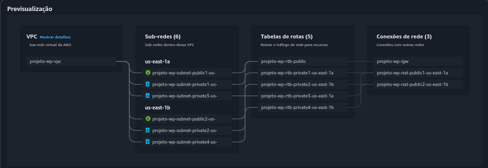

[](README.en.md)
[](README.md)

# Sistema de Alta Disponibilidade de Hospedagem do WordPress

## Sobre o Projeto

Esse projeto consiste na implementação de uma infraestrutura escalável para hospedar aplicações WordPress na AWS. A solução envolve a instalação e configuração do Docker em instâncias EC2, utilizando um script de inicialização para automatizar o processo. Além disso, o projeto inclui a configuração de um banco de dados MySQL gerenciado pelo Amazon RDS, a integração do Amazon EFS para o compartilhamento de arquivos entre as instâncias EC2 que hospedam o WordPress e a implementação de um Application Load Balancer para distribuir o tráfego entre instâncias em múltiplas Zonas de Disponibilidade, garantindo alta disponibilidade. As instâncias EC2 são gerenciadas por um Auto Scaling Group, que ajusta automaticamente a capacidade com base na demanda, assegurando que a aplicação escale de forma eficiente e permaneça disponível mesmo em picos de tráfego.

### Índice

1. [Pré-requisitos](#1-pré-requisitos)
2. [Configuração do Ambiente Virtual](#2-configuração-do-ambiente-virtual)
    - 2.1 [Configurações Gerais](#21-configurações-gerais)
    - 2.2 [Criação da VPC](#22-criação-da-vpc)
3. [Configuração dos Grupos de Segurança](#3-configuração-dos-grupos-de-segurança)
    - 3.1 [Criação dos Grupos de Segurança](#31-criação-dos-grupos-de-segurança)
    - 3.2 [Configuração das Regras de Entrada e Saída](#32-configuração-das-regras-de-entrada-e-saída)
4. [Configuração do Elastic File System (EFS)](#4-configuração-do-elastic-file-system-efs)
    - 4.1 [Configurações Gerais](#41-configurações-gerais)
    - 4.2 [Configurações de Rede](#42-configurações-de-rede)
    - 4.3 [Política do Sistema de Arquivos](#43-política-do-sistema-de-arquivos)
    - 4.4 [Revisão das Configurações](#44-revisão-das-configurações)
5. [Configurações do Relational Database Service (RDS)](#5-configuração-do-relational-database-service-rds)
    - 5.1 [Configurações Gerais](#51-configurações-gerais)
    - 5.2 [Configurações de Rede](#52-configurações-de-rede)
    - 5.3 [Configurações de Autenticação](#53-configurações-de-autenticação)
    - 5.4 [Configurações Adicionais](#54-configurações-adicionais)
6. [Configuração do Application Load Balancer (ALB)](#6-configuração-do-application-load-balancer)
    - 6.1 [Configurações Gerais](#61-configurações-gerais)
    - 6.2 [Configurações de Rede](#62-configurações-de-rede)
7. [Configuração do Auto Scaling Group (ASG)](#7-configuração-do-auto-scaling-group-asg)
    - 7.1 [Configurações Gerais](#71-configurações-gerais)
    - 7.2 [Configuração do Modelo de Execução](#72-configuração-do-modelo-de-execução)

## 1. Pré-requisitos

- Uma conta ativa na AWS
- Conhecimento básico do console AWS
- Conhecimento básico do terminal Linux
- Familiaridade com conceitos de conteinerização

## 2. Configuração do Ambiente Virtual 

Antes de criarmos as instâncias EC2 que hospedarão as aplicações do WordPress e configurar os demais serviços de segurança, armazenamento e balanceamento de carga, precisamos configurar o ambiente de rede onde o projeto será executado. Criaremos uma VPC (Virtual Private Cloud) dedicada ao projeto.

> [!NOTE]
> A AWS oferece duas opções para criação de VPC: manual e automática. Na criação manual,  você configura a VPC, sub-redes, roteadores, gateways e outras opções de rede de forma  personalizada. Já na opção automática, o **assistente de VPC** cria a VPC com sub-redes públicas e  privadas, já anexa um gateway de internet, configura as tabelas de rotas e inclui um gateway NAT, caso seja necessário. Utilizaremos a criação automática com o VPC wizard. 

### 2.1 Configurações Gerais
 
1. No console AWS, acesse o serviço VPC e clique em "**Criar VPC**".

2. Em "**Configurações da VPC**" selecione "**VPC e muito mais**"

3. Em "**Geração automática de etiqueta de nome**", deixe marcado para gerar os nomes automaticamente.

4. No campo de entrada, digite a etiqueta que deseja utilizar como prefixo para o nome dos recursos que serão criados.

5. Configure os recursos:

    - CIDR da VPC: 10.0.0.0/16
    - Número de zonas de disponibilidade (AZs): 2
    - Número de sub-redes públicas: 2
    - Número de sub-redes privadas: 4 
    - Gateway NAT: 1 por AZ
    - VPC endpoints: Nenhuma 

6. Opcionalmente, adicione tags descritivas à VPC. Isso ajuda a identificar facilmente os recursos associados ao projeto.

## 2.2 Criação da VPC 

1. Clique em "**Criar VPC**" e aguarde a criação dos recursos.

2. O assistente criará automaticamente:

    - Uma VPC com DNS hostnames habilitados
    - Duas sub-redes públicas, um em cada Zona de Disponibilidade (AZ) selecionada
    - Duas sub-redes privadas, um em cada AZ selecionada, para os servidores das aplicações e armazenamento do banco de dados
    - Um Internet Gateway (IGW) anexado à VPC 
    - Dois NAT Gateways, um em cada sub-rede pública, para permitir acesso à internet para as sub-redes privadas
    - Tabelas de rota configuradas para:

        - sub-redes públicas com rotas para o Internet Gateway
        - sub-redes privadas com rotas para os respectivos NAT Gateways

    - Um grupo de segurança padrão

#### Preview do VPC Workflow



## 3. Configuração dos Grupos de Segurança

Como cada recurso exige regras de tráfego distintas, criaremos grupos de segurança específicos para cada um deles, de modo a separar as responsabilidades, facilitar o gerenciamento e aumentar a segurança.

### 3.1 Criação dos Grupos de Segurança

> [!IMPORTANT]
> Nesse primeiro momento, criaremos apenas os grupos de segurança, sem nenhuma regra de tráfego. Isso é necessário porque alguns grupos de segurança precisarão referenciar outros em suas regras de entrada ou saída em etapas futuras.

No **Painel da VPC**, navegue até a seção "**Segurança**" e clique em "**Grupos de segurança**". Após isso, clique em "**Criar grupo de segurança**".

Criaremos um grupo de segurança para o balanceador de carga, as instâncias EC2, o EFS e o RDS. Para cada grupo de segurança, preencheremos:

- Nome do grupo de segurança 
- Descrição
- ID da VPC (selecione a VPC criada para o projeto)

### 3.2 Configuração das Regras de Entrada e Saída

Após criados os grupos de segurança, daremos sequência à configuração das regras de entrada e saída de cada um deles.

#### 3.3 Grupo de Segurança do Classic Load Balancer (CLB)

1. Selecione o grupo de segurança do CLB, clique em "**Ações**" e "**Editar regras de entrada**".

2. Clique em "**Adicionar regra**" e adicione uma regra para o **HTTP**:

    - Tipo: HTTP
    - Porta: 80
    - Tipo de origem: qualquer local-ipv4 (0.0.0.0/0)

3. Clique em "**Salvar regras**".

4. Selecione o grupo de segurança do CLB novamente, clique em "**Ações**" e "**Editar regras de saída**".

5. Clique em "**Adicionar regra**" e adicione uma regra para permitir tráfego para as **instâncias EC2**:

    - Tipo: HTTP
    - Porta: 80
    - Tipo de destino: personalizado
    - Destino: selecione o grupo de segurança das **instâncias EC2**

#### 3.4 Grupo de Segurança das Instâncias EC2

1. Selecione o grupo de segurança das instâncias EC2, clique em "**Ações**" e "**Editar regras de entrada**".

2. Clique em "**Adicionar regra**" e adicione uma regra para o **HTTP**:

    - Tipo: HTTP
    - Porta: 80
    - Tipo de origem: personalizado
    - Origem: selecione o **grupo de segurança do CLB**

3. Adicione uma regra para o **NFS**:

    - Tipo: NFS
    - Porta: 2049
    - Tipo de origem: personalizado
    - Origem: selecione o **grupo de segurança do EFS**

4. Clique em "**Salvar regras**".

5. Selecione o grupo de segurança das instâncias EC2 novamente, clique em "**Ações**" e "**Editar regras de saída**".

6. Em "**regras de saída**", remova a regra padrão para evitar conflitos de roteamento, e, em seguida, clique em "**Adicionar regra**".

7. Adicione uma regra para permitir tráfego para o **RDS**:

    - Tipo: MySQL/Aurora
    - Porta: 3306 
    - Tipo de destino: personalizado 
    - Destino: selecione o **grupo de segurança do RDS**

8. Adicione uma regra para permitir tráfego para o **EFS**:

    - Tipo: NFS
    - Porta: 2049 
    - Tipo de destino: personalizado
    - Destino: selecione o **grupo de segurança do EFS**

9. Adicione uma regra para o **HTTPS**:

    - Tipo: HTTPS
    - Porta: 443 
    - Tipo de destino: personalizado 
    - Destino: 0.0.0.0/0 (para atualizações de pacotes ou chamadas externas)

10. Clique em "**Salvar regras**".

#### 3.5 Grupo de Segurança do Elastic File System (EFS)

1. Selecione o grupo de segurança do EFS, clique em "**Ações**" e "**Editar regras de entrada**".

2. Em "**Regras de entrada**", clique em "**Adicionar regra**".

3. Adicione uma regra para o **NFS**:

    - Tipo: NFS
    - Porta: 2049
    - Tipo de origem:  personalizado
    - Origem: selecione o **grupo de segurança das instâncias EC2**

4. Clique em "**Salvar regras**".

5. Verifique as "**Regras de saída**":
    
    - Mantenha a regra que permite todo tráfego de saída

#### 3.6 Grupo de Segurança do Relational Database Service (RDS)

1. Selecione o grupo de segurança do RDS, clique em "**Ações**" e "**Editar regras de entrada**".

2. Em "**Regras de entrada**", clique em "**Adicionar regra**".

3. Adicione uma regra para o **MySQL/Aurora**:

    - Tipo: MySQL/Aurora
    - Porta: 3306
    - Tipo de origem: personalizado
    - Origem: selecione o **grupo de segurança das instâncias EC2**

4. Clique em "**Salvar regras**".

5. Verifique as "**Regras de saída**":
    
    - Mantenha a regra que permite todo tráfego de saída

## 4. Configuração do Elastic File System (EFS)

Iremos configurar um sistema de arquivos elástico para que as instâncias que hospedam o WordPress possam compartilhar arquivos mesmo em diferentes zonas de disponibilidade.

#### 4.1 Configurações Gerais

1. Na barra de pesquisa do console AWS, procure por "**EFS**".

2. Na página inicial do serviço, clique em "**Criar sistema de arquivos**" e "**Personalizar**".

3. Dê um nome ao sistema de arquivos.

4. Em "**Tipo do sistema de arquivos**", selecione "**Regional**".

5. Mantenha as **configurações gerais** padrão:

    - Backup automático: **Habilitado**
    - Gerenciamento de ciclo de vida: 
        - Transição para Infrequent Access: **30 dias desde o último acesso**
        - Transição para Archive: **90 dias desde o último acesso**
        - Transição para o Padrão: **Nenhum**
    - Criptografia: **Habilitado**

6. Mantenha as **configurações de performance** padrão:

    - Modo de taxa de transferência: "**Avançado**" e "**Elastic**"

7. Verifique as **configurações adicionais** e cerfique-se de que "**Uso geral**" está selecionado. 

8. Opcionalmente, adicione tags descritivas ao sistema de arquivos para melhorar a identificação dos recursos.

9. Clique em "**Próximo**".

#### 4.2 Configurações de Rede

1. Em "**Rede**", selecione a VPC criada para o projeto. 

2. Em "**Destinos de montagem**", adicionaremos dois destinos de montagem, um para cada zona de disponibilidade: 

    AZ 1:
    - Zona de disponibilidade: "**us-east-1a**"
    - ID da sub-rede: selecione a **sub-rede privada** disponível
    - Endereço de IP: mantenha o padrão ("**Automático**")
    - Grupos de segurança: selecione o **grupo de segurança do EFS**
   
    AZ 2:
    - Zona de disponibilidade: "**us-east-1b**"
    - ID da sub-rede: selecione a **sub-rede privada** disponível
    - Endereço de IP: mantenha o padrão ("**Automático**")
    - Grupos de segurança: selecione o **grupo de segurança do EFS**

3. Clique em "**Próximo**".

#### 4.3 Política do Sistema de Arquivos

Mantenha todas as opções como padrão e clique em "**Próximo**".

#### 4.4 Revisão das Configurações

Nessa etapa, verifique todas as configurações. Se tudo estiver conforme configurado nas etapas anteriores, clique em "**Criar**".

## 5. Configuração do Relational Database Service (RDS)

Iremos configurar o Amazon RDS para garantir que ambas as aplicações do WordPress tenham uma base de dados persistente e escalável, com alta disponibilidade entre diferentes zonas de disponibilidade. O RDS é um serviço gerenciado de banco de dados que facilita a configuração, operação e escalabilidade de vários tipos de bancos de dados, como MySQL, PostgreSQL, MariaDB, Oracle e SQL Server, com backups automáticos, failover e segurança integrados. Para esse projeto, iremos utilizar uma instância do **MySQL** no RDS.

#### 5.1 Configurações Gerais

1. Na barra de pesquisa do console AWS, procure por "**RDS**".

2. Na página inicial do serviço, clique em "**Criar banco de dados**". 

3. Selecione "**Criação padrão**".

4. Em "**Opções de mecanismo**", selecione o banco de dados "**MySQL**" e mantenha a versão do mecanismo padrão.

5. Em "**Modelos**", selecione "**Nível gratuito**".

6. Em "**Configurações**", dê um nome descritivo à instância do banco de dados.

7. Em "**Configurações de credenciais**", digite um nome de usuário para a instância do banco de dados. Esse será o ID do usuário principal do banco de dados.

8. Em "**Gerenciamento de credenciais**", selecione "**Configurações de credenciais**". Nessa opção, o RDS gera uma senha e a gerencia durante todo o ciclo de vida usando o **AWS Secrets Manager**.

9. Em "**Configuração da instância**", selecione "**db.t3.micro**".

10. Em "**Armazenamento**", mantenha as opções padrão.

#### 5.2 Configurações de Rede

1. Em "**Conectividade**", selecione "**Não se conectar a um recurso de computação do EC2**". Iremos configurar a conexão às instâncias EC2 manualmente mais tarde.

2. Em "**Nuvem privada virtual (VPC)**", selecione a VPC criada para o projeto.

3. Em "**Grupo de sub-redes de banco de dados**", selecione a opção "**Criar novo grupo de sub-redes do banco de dados**".

4. Em "**Acesso público**", selecione a opção "**Não**".

5. Em "**Grupo de segurança de VPC (firewall)**", selecione a opção "**Selecionar existente**", e, em "**Grupos de segurança da VPC existentes**", selecione o **grupo de segurança do RDS** criado anteriormente.

6. Em "**Zona de disponibilidade**", selecione a opção "**Sem preferência**".

#### 5.3 Configurações de Autenticação 

1. Em "**Autenticação de banco de dados**", selecione a opção "**Autenticação de senha**".

#### 5.4 Configurações Adicionais

1. Em "**Nome do banco de dados inicial**", dê um nome descritivo ao banco de dados.

> [!IMPORTANT]
> É recomendável especificar um nome de banco de dados ao criar o RDS. Caso contrário, o RDS criará apenas a instância do MySQL sem um banco de dados dentro dela, e você precisará criá-lo manualmente depois.

2. Mantenha as demais configurações (Backup, Criptografia, Logs, etc.) padrão.

3. Em "**Custos mensais estimados**", revise as informações e certifique-se de que o uso se enquadra no nível gratuito.

4. Se tudo estiver conforme configurado nas etapas anteriores, clique em "**Criar banco de dados**".

## 6. Configuração do Classic Load Balancer (CLB)

O serviço de **Elastic Load Balancing** distribui automaticamente o tráfego entre vários alvos, como instâncias EC2, contêineres e IPs, em múltiplas zonas de disponibilidade. Ele monitora a saúde dos alvos e encaminha requisições apenas para os que estão operacionais, ajustando sua capacidade conforme a demanda. A AWS oferece diferentes tipos de balanceadores de carga. Para esse projeto, utilizaremos o **Classic Load Balancer**.

#### 6.1 Configurações Gerais

1. Na barra de pesquisa do console AWS, procure por "**Balanceadores de carga**".

2. Clique em "**Criar load balancer**".

3. Como **tipo de load balancer**, selecione "**Classic Load Balancer**" e clique em "**Criar**".

4. Dê um nome descritivo ao load balancer.

5. Em "**Esquema**", selecione "**Voltado para a internet**".

#### 6.2 Configurações de Rede

1. Em "**Mapeamento de rede**", selecione a VPC criada para o projeto.

2. Em "**Mapeamentos**", selecione as duas zonas de disponibilidade (**us-east-1a** e **us-east-1b**) e selecione a **sub-rede pública** disponível em cada uma delas.

3. Em "**Grupos de segurança**", selecione o **grupo de segurança do CLB**.

4. Em "**Listeners e roteamento**", certifique-se de que tanto o protocolo do *listener* quanto o da *instância* é o protocolo **HTTP** (Porta **80**).

5. Em ¨**Verificação de integridade**", mantenha padrão.

6. Em "**Instâncias**", não adicionaremos instâncias manualmente, pois elas serão adicionadas dinamicamente mais tarde pelo Auto Scaling Group.

7. Em "**Atributos**", certifique-se de que a opção "**Habilitar balanceamento de carga entre zonas**" está selecionada e mantenha as demais padrão.

8. Clique em "**Criar load balancer**".

## 7. Configuração do Auto Scaling Group (ASG)

O Auto Scaling Group (ASG) é um serviço que gerencia a escalabilidade e a disponibilidade das instâncias EC2. Ele utiliza um modelo de execução baseado em políticas, que ajustam automaticamente o número de instâncias em resposta a métricas de demanda, como a utilização de CPU ou tráfego. Isso assegura que a infraestrutura esteja dimensionada de forma otimizada, tanto para alta carga quanto para períodos de menor demanda.

#### 7.1 Configurações Gerais

1. Na barra de pesquisa do console AWS, procure por "**Grupos de Auto Scaling**".

2. Dê um nome descritivo ao grupo de Auto Scaling, e, em seguida, em "**Modelo de execução**", clique e "**Criar um modelo de execução**".

#### 7.2 Configuração do Modelo de Execução 

1. Dê um nome e uma descrição ao modelo de execução.

2. Em "**Imagens de aplicação e de sistema operacional**", selecione a AMI do **Amazon Linux 2023**.

3. Em "**Tipo de instância**", selecione "**t2.micro**".

4. Em "**Par de chaves**", crie um par de chaves ou selecione um par de chaves já existente para se conectar às instâncias EC2.

5. Em "**Configurações de rede**", selecione "**Não incluir no modelo de execução**", e, em seguida, em "**Firewall**", selecione o **grupo de segurança das instâncias EC2**".

6. Mantenha as demais opções padrão e clique em "**Detalhes avançados**".

7. Mantenha as demais opções padrão e vá até a última opção ("**Dados do usuário**").

8. Criaremos um script de inicialização para ambas as instâncias EC2 que:

    - Monta automaticamente o sistema de arquivos EFS 
    - Conecta automaticamente à instância do banco de dados RDS 
    - Faz a instalação do Docker e do Docker Compose e a configuração do WordPress conteinerizado

---

#### *Script de Inicialização*

```bash
```

---

#### 7.4 Criação do ASG

1. Após configurado o **modelo de execução**, retorne à aba "**Criar grupo de Auto Scaling**".

2. Em "**Modelo de execução**", selecione o modelo de execução criado anteriormente.

3. Clique em "**Próximo**".

4. Em "**Rede**", selecione a VPC criada para o projeto, e, em "**Zonas de disponibilidade e sub-redes**", selecione as todas **sub-redes privadas** disponíveis. 

5. Em "**Distribuição da zona de disponibilidade**", selecione "**Melhor esforço equilibrado**".

6. Clique em "**Próximo**".

7. Em "**Balanceamento de carga**", selecione "**Anexar a um balanceador de carga existente**".

8. Em "**Anexar a um balanceador de carga existente**", selecione "**Escolher entre Classic Load Balancers**". Selecione o CLB criado anteriormente.

9. Mantenha as demais opções padrão e clique em "**Pular para a revisão**".

10. Clique em "**Criar grupo de Auto Scaling**".