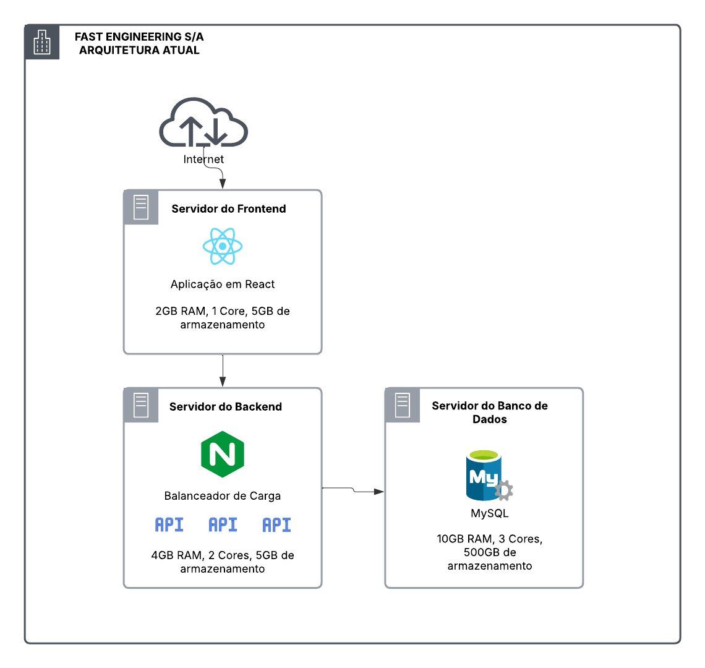

# **Migração e Modernização na AWS: De Lift-and-Shift ao Kubernetes com MGN e DMS**

## Sobre o Projeto

A **Fast Engineering S/A** está em um processo de modernização de sua infraestrutura de eCommerce, visando uma migração para a AWS. A solução atual não atende mais à alta demanda de acessos e compras, e por isso, a empresa está adotando uma abordagem de migração em duas fases:

1. **Migração "Lift-and-Shift" (as-is)**: Essa fase inicial tem como objetivo a rápida migração dos sistemas para a AWS, sem mudanças significativas na arquitetura, garantindo que a infraestrutura atenda a demanda crescente de forma imediata. Para isso, será utilizado o **AWS MGN (Application Migration Service)** para a migração dos servidores, enquanto o **AWS DMS (Database Migration Service)** será responsável pela migração do banco de dados de forma eficiente e com o mínimo de downtime.
  
2. **Modernização para o Kubernetes**: Após a migração, a infraestrutura será modernizada para um ambiente baseado em Kubernetes, utilizando o **Amazon EKS (Elastic Kubernetes Service)**. O **EKS** oferece uma solução totalmente gerenciada para execução de clusters Kubernetes, permitindo maior escalabilidade, disponibilidade e facilidade de gerenciamento. 

A nova arquitetura será planejada para atender as seguintes diretrizes:

- **Ambiente Kubernetes** para gerenciamento eficiente de containers.
- **Banco de dados gerenciado** (PaaS, Multi-AZ) para garantir alta disponibilidade e escalabilidade.
- **Backup de dados** para proteção e recuperação.
- **Sistema de persistência de objetos** (como imagens, vídeos, etc.) para armazenamento escalável e durável.
- **Segurança** aprimorada para proteger os dados e a infraestrutura.

### Índice 

1. [Arquitetura Atual](#1-arquitetura-atual)
    - 1.1 [Visão Geral da Arquitetura](#11-visão-geral-da-arquitetura)
    - 1.2 [Infraestrutura dos Servidores](#12-infraestrutura-dos-servidores)
    - 1.3 [Diagrama da Arquitetura Atual](#13-diagrama-da-arquitetura-atual)
2. [Arquitetura Proposta](#2-arquitetura-proposta)
  - 2.1 [Etapa 1: As-Is](#21-etapa-1-as-is)
      - 2.1.1 [Diagrama](#211-diagrama)
  - 2.2 [Etapa 2: Modernização](#22-etapa-2-modernização)
      - 2.2.1 [Diagrama](#221-diagrama)
3. [Custos Totais](#3-custos-totais)
  - 3.1 [As-Is](#31-as-is)
  - 3.2 [Após Modernização](#32-após-modernização)

### 1.1 Visão Geral da Arquitetura
O sistema atual utiliza uma arquitetura de três camadas com servidores separados para banco de dados, frontend e funções do backend. O Nginx no servidor do backend atua como balanceador de carga para as três APIs e serve conteúdo estático, enquanto o frontend em React e o banco de dados MySQL operam em servidores dedicados.

## 1.2 Infraestrutura dos Servidores

### Servidor do Banco de Dados

- **Finalidade**: Servidor de Banco de Dados MySQL
- **Armazenamento**: 500GB de dados
- **Memória**: 10GB RAM
- **Processamento**: 3 Cores

### Servidor do Frontend

- **Finalidade**: Aplicação React
- **Armazenamento**: 5GB de dados
- **Memória**: 2GB RAM
- **Processamento**: 1 Core

### Servidor do Backend

- **Finalidade**: APIs de Backend com Balanceador de Carga Nginx
- **Componentes**:
  - 3 APIs
  - Nginx
  - Armazenamento de arquivos estáticos
- **Armazenamento**: 5GB de dados
- **Memória**: 4GB RAM
- **Processamento**: 2 Cores

## 1.3 Diagrama da Arquitetura Atual

## 2. Arquitetura Proposta
### 2.1 Etapa 1: As-Is
#### 2.1.1 Diagrama
### 2.2 Etapa 2: Modernização
#### 2.2.1 Diagrama
## 3. Custos Totais
### 3.1 As-Is
### 3.2 Após Modernização