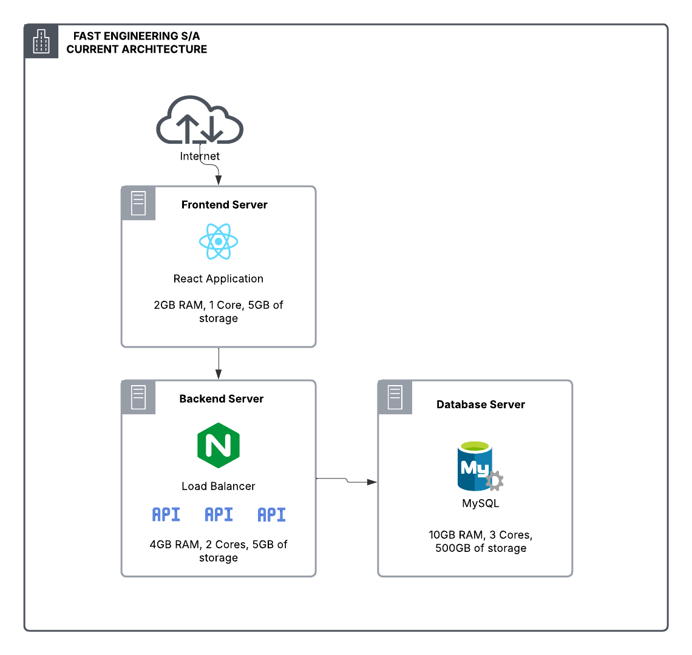
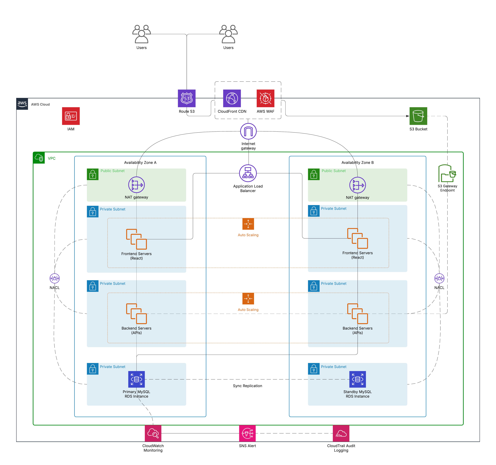

# **Migração e Modernização na AWS: De Lift-and-Shift ao Kubernetes com MGN e DMS**

## Sobre o Projeto

A **Fast Engineering S/A** está em um processo de modernização de sua infraestrutura de eCommerce, visando uma migração para a AWS. A solução atual não atende mais à alta demanda de acessos e compras, e por isso, a empresa está adotando uma abordagem de migração em duas fases:

1. **Migração "Lift-and-Shift" (as-is)**: Esta fase inicial tem como objetivo a rápida migração dos sistemas para a AWS, sem mudanças significativas na arquitetura, garantindo que a infraestrutura atenda a demanda crescente de forma imediata. Para isso, utilizamos o **AWS MGN (Application Migration Service)** para a migração dos servidores, enquanto o **AWS DMS (Database Migration Service)** será responsável pela migração do banco de dados de forma eficiente e com o mínimo de downtime.
  
2. **Modernização para o Kubernetes**: Após a migração, a infraestrutura será modernizada para um ambiente baseado em Kubernetes, utilizando o **Amazon EKS (Elastic Kubernetes Service)**. O **EKS** oferece uma solução totalmente gerenciada para execução de clusters Kubernetes, permitindo maior escalabilidade, disponibilidade e facilidade de gerenciamento. 

A nova arquitetura será planejada para atender as seguintes diretrizes:

- **Ambiente Kubernetes** para gerenciamento eficiente de containers.
- **Banco de dados gerenciado** (PaaS, Multi-AZ) para garantir alta disponibilidade e escalabilidade.
- **Backup de dados** para proteção e recuperação.
- **Sistema de persistência de objetos** (como imagens, vídeos, etc.) para armazenamento escalável e durável.
- **Segurança** aprimorada para proteger os dados e a infraestrutura.

### Índice 

1. [Arquitetura Atual](#1-arquitetura-atual)
    - 1.1 [Visão Geral da Arquitetura](#11-visão-geral-da-arquitetura)
    - 1.2 [Infraestrutura dos Servidores](#12-infraestrutura-dos-servidores)
    - 1.3 [Diagrama da Arquitetura Atual](#13-diagrama-da-arquitetura-atual)
2. [Migração Lift-and-Shift (As-Is)](#2-migração-lift-and-shift-as-is)
    - 2.1 [Migração do Servidor de Banco de Dados com DMS](#21-migração-do-servidor-de-banco-de-dados-com-dms)
    - 2.2 [Migração dos Servidores de Aplicação com MGN](#22-migração-dos-servidores-de-aplicação-com-mgn)
    - 2.3 [Serviços Utilizados](#23-serviços-utilizados)
    - 2.4 [Diagrama Pós-Migração](#23-diagrama-pós-migração)
    - 2.5 [Custos da Migração](#25-custos-da-migração)
    - 2.6 [Custos da Infraestrutura Pós-Migração](#26-custos-da-infraestrutura-pós-migração)
    
### 1.1 Visão Geral da Arquitetura
O sistema atual utiliza uma arquitetura de três camadas com servidores separados para banco de dados, frontend e funções do backend. O Nginx no servidor do backend atua como balanceador de carga para as três APIs e serve conteúdo estático, enquanto o frontend em React e o banco de dados MySQL operam em servidores dedicados.

## 1.2 Infraestrutura dos Servidores

### Servidor do Banco de Dados

- **Finalidade**: Servidor de Banco de Dados MySQL
- **Armazenamento**: 500GB de dados
- **Memória**: 10GB RAM
- **Processamento**: 3 Cores

### Servidor do Frontend

- **Finalidade**: Aplicação React
- **Armazenamento**: 5GB de dados
- **Memória**: 2GB RAM
- **Processamento**: 1 Core

### Servidor do Backend

- **Finalidade**: APIs de Backend com Balanceador de Carga Nginx
- **Componentes**:
  - 3 APIs
  - Nginx
  - Armazenamento de arquivos estáticos
- **Armazenamento**: 5GB de dados
- **Memória**: 4GB RAM
- **Processamento**: 2 Cores

## 1.3 Diagrama da Arquitetura Atual

## 2. Migração Lift-and-Shift (As-Is)

### 2.1 Migração do Servidor de Banco de Dados com DMS

Nesta primeira etapa, utilizamos o AWS Database Migration Service (DMS) para migrar o banco de dados MySQL do ambiente on-premises para a AWS, com a opção de migração **sem servidor**. A opção sem servidor elimina a necessidade de gerenciar manualmente instâncias de replicação, ajustando automaticamente a capacidade conforme necessário durante a migração do banco. Neste modelo de migração, os custos são gerados apenas pelos recursos efetivamente utilizados durante o processo, o que otimiza os gastos, sem a necessidade de dimensionar ou gerenciar a infraestrutura.

#### Configuração dos Endpoints de Origem e Destino

O primeiro passo é configurar os endpoints no AWS DMS sem servidor:

  - **Configuração do endpoint de origem:** Definimos o banco de dados MySQL on-premises como origem, fornecendo detalhes de conexão necessários.
  - **Configuração de acesso à rede:** Implementamos uma VPN para estabelecer uma conexão segura entre o ambiente on-premises e a AWS.
  - **Configuração do endpoint de destino:** Definimos o Amazon RDS for MySQL como destino da migração.

#### Criação da Replicação Sem Servidor

Após configurar os endpoints, seguimos para a criação da replicação sem servidor:

  - **Definição de capacidade:** Configuramos as unidades de capacidade mínimas e máximas (DCUs) que o DMS pode provisionar automaticamente conforme a necessidade.
  - **Configuração de escalonamento automático:** Aproveitamos a capacidade do DMS sem servidor de gerenciar automaticamente o provisionamento de recursos.
  - **Definição de parâmetros de replicação:** Ajustamos configurações específicas para garantir uma migração eficiente e confiável.

#### Execução da Replicação

Com a replicação configurada, iniciamos o processo de migração:

  - **Coleta de metadados:** O DMS se conecta ao banco de origem e coleta os metadados necessários.
  - **Provisionamento automático:** O serviço provisiona a capacidade adequada para a replicação, conforme a configuração estabelecida.
  - **Monitoramento do escalonamento:** Acompanhamos como o DMS ajusta automaticamente os recursos conforme a carga de trabalho da migração.

#### Testes de Validação

Após a conclusão da migração, realizamos testes:

  - **Verificação de integridade dos dados:** Comparamos os dados entre origem e destino para garantir que foram transferidos corretamente.
  - **Testes de desempenho:** Executamos consultas para avaliar o tempo de resposta do banco de dados migrado.

### 2.2 Migração dos Servidores de Aplicação com MGN

Nesta segunda etapa, utilizamos o **Application Migration Service** para migrar os servidores do ambiente on-premises para a AWS com o mínimo de downtime, sem alterações significativas na infraestrutura.

#### Servidores de Origem

Como primeiro passo, é essencial a instalação de um **agente de replicação** nos servidores on-premises. Para isso, criamos um usuário do IAM na AWS com as permissões necessárias para interagir com os recursos da AWS e permitir a replicação dos dados a partir dos servidores de origem para a nuvem.

#### Servidores de Replicação

Neste passo, servidores de replicação são provisionados automaticamente pelo AWS MGN com base em um modelo de configuração de replicação. No nosso caso, o Replication Settings Template define os parâmetros necessários para a configuração, incluindo a subnet privada, o acesso à internet via NAT Gateway e as regras de firewall para a conectividade com os servidores on-premises. Estes servidores são responsáveis por armazenar temporariamente e processar os dados dos servidores on-premises antes de enviá-los à **staging area**.

#### Staging Area 

Após a replicação dos dados para o servidor de replicação, os dados são enviados para a staging area na AWS, no nosso caso consistindo em um volume EBS. Nesta área, os dados são armazenados temporariamente e preparados para a conversão final. Durante este processo, são realizadas verificações, como a validação da integridade dos dados replicados, a verificação de consistência entre os dados on-premises e os dados na staging area, e ajustes de configuração necessários, como a adaptação de caminhos de diretórios, parâmetros de rede, permissões ou outras configurações específicas de software. Além disso, testes de desempenho são realizados para garantir que a infraestrutura da AWS seja capaz de lidar com o volume de dados. Uma vez validados e ajustados, os dados estão prontos para serem transformados em instâncias EC2 na AWS.

#### Conversão e Lançamento das Instâncias EC2

Após a preparação e validação dos dados na staging area, os dados são convertidos em instâncias EC2 na AWS. Este processo transforma os volumes EBS que contêm os dados replicados em volumes de armazenamento anexados a instâncias EC2 configuradas de acordo com as necessidades do ambiente. As instâncias EC2 são então configuradas com a infraestrutura necessária, incluindo:

  - **Configuração de rede:** As instâncias são colocadas em subnets privadas com regras de segurança definidas nos grupos de segurança e Network ACLs.
  - **Balanceamento de carga:** Um **Application Load Balancer** é configurado para distribuir o tráfego de forma eficiente entre as instâncias EC2, garantindo alta disponibilidade.
  - **Auto Scaling:** As instâncias EC2 são configuradas em um **Auto Scaling Group** para permitir a escalabilidade automática com base na demanda de tráfego.

#### Testes

Nesta etapa, realizamos testes para garantir que tudo está funcionando como esperado. As instâncias migradas são avaliadas em um ambiente de pré-produção na AWS, sem afetar o ambiente de produção original. Isso permite verificar a funcionalidade e a acessibilidade dos dados, além de identificar e corrigir possíveis problemas. Aqui, são realizados os seguintes testes:

  - **Verificação de dados:** Verificar se os dados foram replicados corretamente e estão acessíveis de forma adequada.
  **Validação de desempenho:** Avaliar o desempenho das instâncias na AWS e compará-lo com o ambiente on-premises para garantir que os requisitos de capacidade estão sendo atendidos.
  - **Testes de aplicação:** Validar se as aplicações estão funcionando como esperado (exemplo: frontend se comunica com backend, APIs estão funcionando, etc.).
  - **Testes de integração:** Verificar se os diferentes componentes do sistema (exemplo: backend, banco de dados, load balancing) estão funcionando corretamente em conjunto.

#### Cutover

O cutover é a etapa final, onde a infraestrutura na AWS é oficialmente colocada em produção. Após os testes bem-sucedidos, a migração é finalizada, e a produção no ambiente local é desativada em favor do novo ambiente na nuvem. Para garantir consistência e minimizar o downtime, o cutover do banco de dados e das aplicações é realizado de forma coordenada. Isso envolve:

  - **Desativação de sistemas locais:** Após a validação final, os servidores on-premises são desativados para garantir que não haja mais escritas no banco de dados.
  - **Finalização da Replicação do DMS:** O DMS aplica todas as alterações pendentes no banco de dados AWS, garantindo que ele esteja completamente sincronizado com o banco on-premises.
  - **Redirecionamento das aplicações:** As aplicações migradas na AWS são configuradas para apontar para o banco de dados na AWS.
  - **Reconfiguração do DNS e redirecionamento de tráfego:** O DNS é atualizado (através do Route 53) para apontar para a infraestrutura AWS em vez da infraestrutura local.
  - **Monitoramento pós-cutover:** Após o cutover, um período de monitoramento é essencial para garantir que o ambiente na AWS esteja funcionando como esperado e para detectar problemas logo no início.

Neste ponto, o processo de lift-and-shift é concluído e as instâncias estão operando na nuvem com a infraestrutura de suporte configurada para garantir alta disponibilidade, escalabilidade e segurança.

### 2.3 Serviços Utilizados

Durante a migração, além da base essencial de infraestrutura em nuvem (VPC, Security Groups, e demais recursos) e os serviços de migração de aplicações (MGN) e de banco de dados (DMS), utilizamos diversos outros serviços para garantir uma solução eficiente, segura e escalável. Os principais serviços empregados no processo foram:

#### Route 53

  Utilizado para gerenciamento de DNS, permitindo o redirecionamento do tráfego para as novas instâncias e serviços na AWS. Garantindo uma solução escalável de roteamento de tráfego.

#### CloudFront

  Implementado como uma **rede de distribuição de conteúdo (CDN)**, o CloudFront garante a entrega rápida e global de conteúdo estático (como imagens, CSS e JavaScript) armazenado em buckets do S3. Ele utiliza **edge locations** da AWS para cachear o conteúdo mais próximo dos usuários finais, reduzindo a latência e melhorando a experiência de uso. Além disso, o CloudFront é integrado ao **WAF (Web Application Firewall)** para proteger a aplicação contra ataques comuns da web, como **SQL injection**, **cross-site scripting (XSS)** e **DDoS**, garantindo segurança e desempenho otimizados.

#### S3 (Simple Storage Service)

  Utilizado para armazenamento de dados estáticos, como imagens, vídeos e backups. O S3 proporciona durabilidade, escalabilidade e disponibilidade de dados. Aliado ao CloudFront, o S3 atua como origem para o cache de conteúdo estático, permitindo a entrega rápida e global desses arquivos por meio de edge locations da AWS. Essa combinação reduz a latência e diminui a carga sobre os servidores de aplicação.

#### S3 Gateway Endpoint

  O S3 Gateway Endpoint possibilita uma comunicação privada entre a VPC e o S3, sem a necessidade de passar pela internet pública, garantindo conexões mais seguras entre as instâncias em sub-redes privadas e os buckets S3. Além disso, como a comunicação ocorre diretamente pela rede da AWS, a latência é significativamente reduzida.

#### Application Load Balancer (ALB)

  o ALB, com suporte para **roteamento baseado em caminho**, atua como ponto de entrada para tráfego dinâmico, permitindo direcionar requisições para diferentes grupos de instâncias EC2 com base no caminho da URL. Caso uma requisição chegue ao CloudFront e não seja para conteúdo estático (ex.: APIs ou rotas dinâmicas da aplicação), o CloudFront encaminha a requisição ao ALB. O ALB, por sua vez, utiliza **balanceamento de carga entre zonas** para distribuir o tráfego de forma eficiente entre as instâncias EC2 em múltiplas zonas de disponibilidade, garantindo alta disponibilidade e escalabilidade.  

#### NAT Gateway
  Utilizado para permitir que instâncias em subnets privadas acessem a internet (para atualizações de pacotes, envio de logs, etc).

#### Network ACLs (NACLs) 
  Utilizado para controlar o tráfego de entrada e saída no nível de subnets.

#### EC2 (Elastic Compute Cloud)

  Utilizado para provisionar e gerenciar as instâncias de servidores de aplicação na AWS, proporcionando flexibilidade e escalabilidade conforme a demanda de tráfego.

#### Auto Scaling Groups

  Configurado para garantir que as instâncias EC2 escalem automaticamente de acordo com a demanda de tráfego, permitindo alta disponibilidade e desempenho sob diferentes cargas.

#### RDS (Relational Database Service)

  Utilizado para a migração e gestão do banco de dados MySQL na AWS, oferecendo alta disponibilidade e backups automáticos, além de reduzir a complexidade da administração do banco de dados.

#### CloudWatch

  Implementado para monitoramento em tempo real dos recursos da AWS, como EC2 e RDS, além de coletar métricas e logs de eventos para garantir a saúde da infraestrutura.

#### Amazon SNS (Simple Notification Service)

  Utilizado para enviar notificações e alertas em tempo real sobre eventos críticos, como falhas em recursos ou alterações na infraestrutura, para equipes responsáveis.

#### CloudTrail

  Implementado para registrar logs de atividades na AWS, permitindo a auditoria de todas as ações realizadas na infraestrutura, aumentando a segurança e a rastreabilidade das operações.

### 2.4 Diagrama Pós-Migração As-Is

### 2.5 Custos da Migração 

### 2.6 Custos da Infraestrutura Pós-Migração

